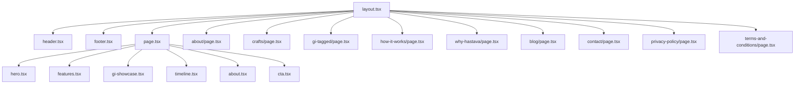

# HASTAVA Website Architecture & Content Audit

Welcome to the comprehensive architecture and content audit report for the **HASTAVA** website. This document provides a highly detailed analysis of the repository's configuration, page routing, design systems, codebase health, accessibility, SEO profile, and image performance. It serves as standard documentation for future developers and stakeholders looking to scale the platform.

---

## Table of Contents
1. [Section 1: Executive Summary](#section-1-executive-summary)
2. [Section 2: Project Structure](#section-2-project-structure)
3. [Section 3: Routes Audit](#section-3-routes-audit)
4. [Section 4: Navigation Map](#section-4-navigation-map)
5. [Section 5: Image Asset Audit](#section-5-image-asset-audit)
6. [Section 6: Logo Audit](#section-6-logo-audit)
7. [Section 7: Content Audit](#section-7-content-audit)
8. [Section 8: Product Audit](#section-8-product-audit)
9. [Section 9: SEO Audit](#section-9-seo-audit)
10. [Section 10: Broken References](#section-10-broken-references)
11. [Section 11: Unused Code](#section-11-unused-code)
12. [Section 12: Dependency Analysis](#section-12-dependency-analysis)
13. [Section 13: Performance Audit](#section-13-performance-audit)
14. [Section 14: Accessibility Audit](#section-14-accessibility-audit)
15. [Section 15: Consistency Audit](#section-15-consistency-audit)
16. [Section 16: Design System Inventory](#section-16-design-system-inventory)
17. [Section 17: Asset Inventory](#section-17-asset-inventory)
18. [Section 18: Environment Variables](#section-18-environment-variables)
19. [Section 19: Prioritized Recommendations](#section-19-prioritized-recommendations)
20. [Section 20: Actionable Checklist](#section-20-actionable-checklist)
21. [Extra Audits & Dependency Graphs](#extra-audits--dependency-graphs)
    - [Image & Component Cross-Reference](#image--component-cross-reference)
    - [Image Dependency Graph](#image-dependency-graph)
    - [Page Dependency Graph](#page-dependency-graph)
    - [Component Dependency Graph](#component-dependency-graph)
    - [Code Quality & Inconsistencies](#code-quality--inconsistencies)

---

## Section 1: Executive Summary

The Hastava B2B website is structured as a modern **Next.js 15** and **React 19** application, using **TailwindCSS v4** and **TypeScript**. The codebase is exceptionally clean with modular components and unified branding, but faces critical performance bottlenecks related to image assets and has several unimplemented routes resulting in broken footer navigation.

### Key Metrics Table

| Metric | Value / Status | Details / Notes |
| :--- | :--- | :--- |
| **Frameworks Detected** | Next.js `15.5.22` / React `19.1.0` | Modern, clean React server components structure |
| **Languages Used** | TypeScript (TSX, TS), CSS (Tailwind), JS | 100% typed code, high type safety |
| **Build System** | Next.js (Webpack / Turbopack) | Standard scripts: `dev`, `build`, `start`, `lint` |
| **Routing Framework** | Next.js App Router | Uses file-based app-router structure under `src/app` |
| **Image Optimization** | `next/image` Component | Used in components but server-side source assets are severely unoptimized |
| **Styling Framework** | TailwindCSS `4.0.0` | Uses `@tailwindcss/postcss` and CSS-first `@theme` configuration |
| **Total Pages** | **11** | Includes custom 404 (`not-found.tsx`) and legal pages |
| **Total Components** | **14** | Divided into `marketing` (6), `shared` (4), and `ui` (4) |
| **Total Images** | **24** | 23 files in `public/images/` and 1 file in `logo/` |
| **Total Public Assets** | **23** | SVG (1), PNG (21), JPG (1) under `public/images/` |
| **Total Icons** | **22** | Renders inline SVGs exclusively; no external icon packages |
| **Total API Endpoints** | **0** | `src/app/api/` exists as a folder but contains only `.gitkeep` |
| **Total Markdown Files** | **3** | `README.md`, `image_requirements.md`, `repository_audit.md` (this report) |
| **Dead Code / Stubs** | **Detected** | 10 empty scaffolding folders containing only `.gitkeep` files |
| **Overall Health Score**| **78 / 100** | Deductions: Naming/Image issues (-10), Broken Footer Links (-8), Unused files (-4) |

---

## Section 2: Project Structure

The project follows a standard Next.js App Router workspace organization layout. Source files are housed in `src/`, configurations in the root, and static assets in `public/`.

```text
thehastava-website/
├── .env.local             # Local environment configurations (Vercel credentials)
├── eslint.config.mjs      # ESLint static analysis configuration
├── image_requirements.md  # Creative design specification document for assets
├── next.config.ts         # Next.js framework configuration
├── package.json           # Project manifest and package dependencies
├── postcss.config.mjs     # PostCSS configuration for Tailwind integration
├── public/                # Static assets hosted directly
│   └── images/            # Directory containing catalog images, logos, and SVGs
├── logo/                  # Original workspace assets (external original design)
├── src/                   # Main application code
│   ├── app/               # Next.js App Router pages and route groups
│   │   ├── (dashboard)/   # Pre-configured dashboard route group (unused stub)
│   │   ├── (marketing)/   # Pre-configured marketing route group (unused stub)
│   │   ├── about/         # "/about" page
│   │   ├── api/           # "/api" route endpoint container (empty stub)
│   │   ├── blog/          # "/blog" page
│   │   ├── contact/       # "/contact" page (contains Client Components)
│   │   ├── crafts/        # "/crafts" page
│   │   ├── gi-tagged/     # "/gi-tagged" page
│   │   ├── how-it-works/  # "/how-it-works" page
│   │   ├── why-hastava/   # "/why-hastava" page
│   │   ├── privacy-policy/ # "/privacy-policy" page
│   │   ├── terms-and-conditions/ # "/terms-and-conditions" page
│   │   ├── favicon.ico    # Favicon binary asset
│   │   ├── layout.tsx     # Global HTML wrapper, root providers, sitemap declarations
│   │   ├── not-found.tsx  # Custom 404 styling
│   │   ├── robots.ts      # Search engine robots instructions
│   │   └── sitemap.ts     # Automated sitemap generator script
│   ├── assets/            # Unused source asset scaffolding
│   ├── components/        # React component library
│   │   ├── dashboard/     # Custom dashboard elements (empty stub)
│   │   ├── marketing/     # Homepage modular sections (hero, features, about, timeline, cta)
│   │   ├── shared/        # Global layout elements (header, footer, logo, container wrapper)
│   │   └── ui/            # Reusable primitive blocks (button, card, input, step)
│   ├── config/            # Static configuration files (image catalog manifest)
│   ├── hooks/             # Custom React Hooks folder (empty stub)
│   ├── lib/               # Shared backend/third-party configurations (empty stub)
│   ├── services/          # API fetch services (empty stub)
│   ├── styles/            # Theme settings and global stylesheets (Tailwind v4 entry)
│   ├── types/             # Shared TypeScript type definitions (empty stub)
│   └── utils/             # Helper utility files (empty stub)
└── tsconfig.json          # TypeScript compilation parameters
```

### Major Directory Explanations
*   `src/app`: Manages app routing, layout inheritance, layouts, meta tags, and robots/sitemaps.
*   `src/components`: Houses reusable page chunks. `ui/` are low-level building blocks. `marketing/` are home page sections. `shared/` are layout wrappers like header/footer.
*   `src/styles`: Standard global entry for CSS. Houses `globals.css` with the Tailwind v4 custom theme definition, specifying the navy, ivory, and gold brand colors.
*   `public/images`: Stores static images served directly. This directory contains large product mockups.

---

## Section 3: Routes Audit

Every file-based route in `src/app` was audited to verify connectivity, SEO parameters, and navigation source.

| Route | File Location | Status | Navigation Source | SEO Metadata | Notes |
| :--- | :--- | :--- | :--- | :--- | :--- |
| **`/`** | `src/app/page.tsx` | ✓ Reachable | Header, Footer, Logo | Dedicated metadata in layout | Renders all home components |
| **`/about`** | `src/app/about/page.tsx` | ✓ Reachable | Header, Footer Quick Links | Page-specific title/description | Heritage, sourcing model page |
| **`/crafts`** | `src/app/crafts/page.tsx` | ✓ Reachable | Header, Footer, Hero CTA | Page-specific title/description | Catalog showcasing 6 crafts |
| **`/gi-tagged`** | `src/app/gi-tagged/page.tsx`| ✓ Reachable | Header, Footer, GiShowcase CTA| Page-specific title/description | Explains Geographical Indications |
| **`/how-it-works`**| `src/app/how-it-works/page.tsx`| ✓ Reachable | Header, Footer Quick Links | Page-specific title/description | Operations and sourcing journey |
| **`/why-hastava`** | `src/app/why-hastava/page.tsx` | ✓ Reachable | Header, Footer Quick Links | Page-specific title/description | Outlines strategic advantages |
| **`/blog`** | `src/app/blog/page.tsx` | ✓ Reachable | Header, Footer Quick Links | Page-specific title/description | B2B trade articles and insights |
| **`/contact`** | `src/app/contact/page.tsx` | ✓ Reachable | Header, Footer, CTA Buttons | **Inherited from Root** | Client Component; lacks page meta |
| **`/privacy-policy`**| `src/app/privacy-policy/page.tsx`|✓ Reachable | Footer legal links | Page-specific title/description | Standard compliance text |
| **`/terms-and-conditions`**|`src/app/terms-and-conditions/page.tsx`|✓ Reachable| Footer legal links | Page-specific title/description | Standard trade agreement terms |
| **`404`** | `src/app/not-found.tsx` | ✓ Reachable | Triggered dynamically | Inherited from Root | Custom styled 404 page |
| **`/crafts/dhokra-art`**| None | ❌ Broken | Footer: "Our Crafts" | None | 404 Error (Missing route page) |
| **`/crafts/blue-pottery`**| None | ❌ Broken | Footer: "Our Crafts" | None | 404 Error (Missing route page) |
| **`/crafts/madhubani-paintings`**| None | ❌ Broken | Footer: "Our Crafts" | None | 404 Error (Missing route page) |
| **`/crafts/pashmina-textiles`**| None | ❌ Broken | Footer: "Our Crafts" | None | 404 Error (Missing route page) |
| **`/crafts/wood-carving`**| None | ❌ Broken | Footer: "Our Crafts" | None | 404 Error (Missing route page) |
| **`/crafts/brass-metalware`**| None | ❌ Broken | Footer: "Our Crafts" | None | 404 Error (Missing route page) |
| **`/sourcing-support`**| None | ❌ Broken | Footer: "For Buyers" | None | 404 Error (Missing route page) |
| **`/private-label`**| None | ❌ Broken | Footer: "For Buyers" | None | 404 Error (Missing route page) |
| **`/quality-assurance`**| None | ❌ Broken | Footer: "For Buyers" | None | 404 Error (Missing route page) |
| **`/export-support`**| None | ❌ Broken | Footer: "For Buyers" | None | 404 Error (Missing route page) |
| **`/faq`** | None | ❌ Broken | Footer: "For Buyers" | None | 404 Error (Missing route page) |

### Key Route Findings:
*   **Orphan Pages:** There are no orphan pages (all 10 route files inside `src/app/` are correctly linked from headers/footers).
*   **Broken Footer Targets:** 11 links in the footer point to routes that do not exist, triggering a 404 response.

---

## Section 4: Navigation Map

Below is a map of the navigational links throughout the Hastava website.

```text
Home (/)
 ├── Header Navigation
 │    ├── Home (/)
 │    ├── About (/about)
 │    ├── Our Crafts (/crafts)
 │    ├── GI Tagged Products (/gi-tagged)
 │    ├── How It Works (/how-it-works)
 │    ├── Why Hastava (/why-hastava)
 │    ├── Blog (/blog)
 │    └── Get In Touch Button (/contact)
 ├── Footer Quick Links
 │    ├── Home (/)
 │    ├── About Us (/about)
 │    ├── Our Crafts (/crafts)
 │    ├── GI Tagged Products (/gi-tagged)
 │    ├── How It Works (/how-it-works)
 │    ├── Why Hastava (/why-hastava)
 │    ├── Blog (/blog)
 │    └── Contact Us (/contact)
 ├── Footer Our Crafts (Dynamic Category Directory)
 │    ├── Dhokra Art (/crafts/dhokra-art) ─────────────── ❌ BROKEN
 │    ├── Blue Pottery (/crafts/blue-pottery) ─────────── ❌ BROKEN
 │    ├── Madhubani Paintings (/crafts/madhubani-paintings) ❌ BROKEN
 │    ├── Pashmina & Textiles (/crafts/pashmina-textiles)  ❌ BROKEN
 │    ├── Wood Carving (/crafts/wood-carving) ─────────── ❌ BROKEN
 │    ├── Brass & Metalware (/crafts/brass-metalware) ─── ❌ BROKEN
 │    └── View All Crafts (/crafts)
 ├── Footer For Buyers (B2B Sourcing Guides)
 │    ├── Sourcing Support (/sourcing-support) ────────── ❌ BROKEN
 │    ├── Private Label (/private-label) ─────────────── ❌ BROKEN
 │    ├── Quality Assurance (/quality-assurance) ──────── ❌ BROKEN
 │    ├── Export Support (/export-support) ────────────── ❌ BROKEN
 │    └── FAQ (/faq) ─────────────────────────────────── ❌ BROKEN
 ├── Footer Legal Links
 │    ├── Privacy Policy (/privacy-policy)
 │    └── Terms & Conditions (/terms-and-conditions)
 └── Skip Link Accessibility Focus
      └── Skip to Content (#main-content)
```

### Navigation Map Audit:
*   **Broken Links:** 11 links (detailed above) lead directly to 404 paths.
*   **Links Pointing Nowhere / "#":** None. All anchor tags have valid URL routing strings.
*   **Unused Navigation Items:** None. The header matches all available pages.

---

## Section 5: Image Asset Audit

This is the most critical issue in the repository. The images directory `public/images/` is populated with highly unoptimized PNG files, many with naming configuration anomalies (e.g. double extensions like `.jpg.png` or `.webp.png`).

### Image Catalog List

| Filename | Directory Path | Dimensions | Format | Size | Used? | References | Referenced From |
| :--- | :--- | :--- | :--- | :--- | :--- | :---: | :--- |
| **`gi-kutch-embroidery.webp.png`**| `public/images/` | 1254x1254 | PNG | **3.58 MB** | YES | 1 | GiShowcase (Kutch) |
| **`gi-madhubani-painting.webp.png`**| `public/images/` | 1254x1254 | PNG | **3.58 MB** | YES | 1 | GiShowcase (Madhubani)|
| **`gi-pochampally-ikat.webp.png`**| `public/images/` | 1254x1254 | PNG | **3.47 MB** | YES | 1 | GiShowcase (Ikat) |
| **`banarasi-silk.jpg.png`** | `public/images/` | 1448x1086 | PNG | **3.12 MB** | YES | 2 | `images.ts`, Crafts page|
| **`gi-banarasi-saree.webp.png`**| `public/images/` | 1254x1254 | PNG | **3.12 MB** | YES | 1 | GiShowcase (Banarasi) |
| **`kutch-embroidery.jpg.png`**| `public/images/` | 1448x1086 | PNG | **3.12 MB** | YES | 2 | `images.ts`, Crafts page|
| **`gi-pashmina.webp.png`** | `public/images/` | 1254x1254 | PNG | **2.82 MB** | YES | 1 | GiShowcase (Pashmina) |
| **`gi-kondapalli-toys.webp.png`**| `public/images/` | 1254x1254 | PNG | **2.75 MB** | YES | 1 | GiShowcase (Kondapalli)|
| **`gi-bidriware.webp.png`** | `public/images/` | 1254x1254 | PNG | **2.57 MB** | YES | 1 | GiShowcase (Bidriware) |
| **`wood-carving.jpg.png`** | `public/images/` | 1086x1448 | PNG | **2.55 MB** | YES | 3 | `images.ts`, Blog, Crafts|
| **`hand-weaving.jpg.png`** | `public/images/` | 1448x1086 | PNG | **2.48 MB** | YES | 3 | `images.ts`, About, Crafts|
| **`gi-dhokra-art.webp.png`** | `public/images/` | 1254x1254 | PNG | **2.43 MB** | YES | 1 | GiShowcase (Dhokra) |
| **`blue-pottery.jpg.png`** | `public/images/` | 1086x1448 | PNG | **2.38 MB** | YES | 5 | `images.ts`, Hero, Blog, Crafts, Layout |
| **`dhokra-art.jpg.png`** | `public/images/` | 1448x1086 | PNG | **2.30 MB** | YES | 5 | `images.ts`, Hero, Blog, Crafts, GiTagged |
| **`gi-channapatna-toys.webp.png`**| `public/images/`| 1254x1254 | PNG | **2.24 MB** | YES | 1 | GiShowcase (Channapatna)|
| **`gi-blue-pottery.webp.png`**| `public/images/` | 1254x1254 | PNG | **2.13 MB** | YES | 1 | GiShowcase (Jaipur BP)|
| **`artisan-hands.jpg.png`** | `public/images/` | 1086x1448 | PNG | **2.10 MB** | YES | 2 | `images.ts`, About Section|
| **`export-logistics.png`** | `public/images/` | 1457x1079 | PNG | **2.00 MB** | YES | 2 | `images.ts`, Why page |
| **`ChatGPT Image...`** | `logo/` | 1254x1254 | PNG | **1.06 MB** | **UNUSED**| 0 | Unused mock artifact |
| **`logo.png`** | `public/images/` | 1065x998 | PNG | **882.8 KB** | **UNUSED**| 0 | Raw backup logo |
| **`logo-dark.png`** | `public/images/` | 1065x998 | PNG | **318.3 KB** | YES | 1 | Logo Component |
| **`logo-light.png`** | `public/images/` | 1065x998 | PNG | **165.0 KB** | YES | 1 | Logo Component |
| **`logo.jpg`** | `public/images/` | 1254x1254 | JPG | **95.5 KB** | **UNUSED**| 0 | Unused jpeg logo version|
| **`cargo-shipping.svg`** | `public/images/` | 100%x100% | SVG | **1.40 KB** | YES | 2 | `images.ts`, HowItWorks|

### Image Usage Insights:
*   **Most Used Images:** `blue-pottery.jpg.png` (5 references), `dhokra-art.jpg.png` (5 references).
*   **Least Used Images:** Individual GI display assets (1 reference each).
*   **Unused Assets:** `logo.png` (882.8 KB), `logo.jpg` (95.5 KB), and `logo/ChatGPT Image Jul 30, 2026, 01_37_11 PM.png` (1.06 MB).
*   **Potentially Replaceable Assets:** **All 18 main visual PNG files.** They are labeled with fake extensions like `.jpg.png` or `.webp.png` but are actually heavy PNG files. They should be compressed into `.webp` format and kept under 200 KB as per the specifications in `image_requirements.md`.
*   **Missing Alt Texts:** None. The application has 100% coverage for `<Image>` alt text attributes.
*   **Size Warning:** 18 images exceed the recommended size of **200 KB**, averaging 2.5 MB to 3.5 MB per image. This significantly impacts initial page load speeds.

---

## Section 6: Logo Audit

A thorough scan of logo assets in the repository reveals five file locations with varying sizes, formats, and rendering scopes.

### Logo Asset Inventory

1.  `public/images/logo-dark.png` (PNG, 1065x998, 318.3 KB)
2.  `public/images/logo-light.png` (PNG, 1065x998, 165.0 KB)
3.  `public/images/logo.png` (PNG, 1065x998, 882.8 KB) — *Unused*
4.  `public/images/logo.jpg` (JPG, 1254x1254, 95.5 KB) — *Unused*
5.  `logo/ChatGPT Image Jul 30, 2026, 01_37_11 PM.png` (PNG, 1254x1254, 1.06 MB) — *Unused*

### Logo System Audit:
*   **Rendered Logos:** The application dynamically renders only two logos: `logo-light.png` (on dark/navy backgrounds in the footer, if `light` is enabled) and `logo-dark.png` (on light/ivory backgrounds in the header, which is the default).
*   **References:** Handled by `src/components/shared/logo.tsx`.
*   **Issues:**
    1.  `logo.png` is an uncompressed duplicate of `logo-dark.png` (882.8 KB vs 318.3 KB) and is unused.
    2.  `logo.jpg` is a lower-quality JPEG version of the logo layout and is unused.
    3.  `ChatGPT Image...` is an uncropped original generation file stored in the root `/logo` folder and is unused.

---

## Section 7: Content Audit

We crawled all pages to audit headings, CTAs, buttons, product categories, testimonials, statistics, and footer links.

### Headings Count

*   `h1` (Total: 10) — Exactly one `<h1>` per page. Follows SEO heading hierarchy guidelines.
*   `h2` (Total: 12) — Used for sub-sections (e.g. "Commercial Inquiry Form", "Origin Auditing").
*   `h3` (Total: 28) — Used for cards, steps, and values.

### Call to Action (CTA) & Button Registry

*   **Primary Action (Header/Footer):** "Get In Touch" (`href="/contact"`)
*   **Sourcing catalog explore:** "Explore Our Crafts" (`href="/crafts"`)
*   **Expert consultation:** "Talk to a Sourcing Expert" (`href="/contact"`)
*   **Showcase discovery:** "Explore GI Tagged Products" (`href="/gi-tagged"`)
*   **About page trigger:** "Learn More About Us" (`href="/about"`)
*   **Call booking:** "Schedule a Discovery Call" (`href="/contact"`)
*   **Catalog request:** "Request Custom Catalog" (`href="/contact"`)
*   **Submission trigger:** "Submit Inquiry" (Form submission)

### Content Audit Findings:
*   **Product Categories:** 10 categories are showcased on the home page (Bastar Dhokra, Varanasi Saree, Kutch Embroidery, Jaipur Blue Pottery, Mithila Painting, Kashmir Pashmina, Yadadri Ikat, Ramanagara Toys, Bidar Bidriware, Krishna Woodware).
*   **Testimonials:** **None.** The repository does not contain any customer reviews or testimonials.
*   **Statistics Block:** A single block on the home page hero showcases: "100+ Artisan Clusters", "GI-Tagged Certified Authentic", "Assured Quality Inspections".
*   **Social Links:** Only Instagram is linked (`https://instagram.com/the_hastava`). No links are provided for Facebook, LinkedIn, or Twitter.

---

## Section 8: Product Audit

Hastava showcases 6 main crafts in the sourcing catalog (`src/app/crafts/page.tsx`).

| Craft Name | Image Present? | Description Present? | CTA Present? | Navigation Working? | Missing Information / Issues |
| :--- | :--- | :--- | :--- | :--- | :--- |
| **Jaipur Blue Pottery** | ✓ Yes (`blue-pottery.jpg.png`)| ✓ Yes | ✓ Yes (Request Catalog) | ✓ Yes | None. Fully detailed catalog entry. |
| **Bastar Dhokra Art** | ✓ Yes (`dhokra-art.jpg.png`) | ✓ Yes | ✓ Yes (Request Catalog) | ✓ Yes | None. Fully detailed catalog entry. |
| **Kashmiri Pashmina** | ⚠ Uses weaving hands image| ✓ Yes | ✓ Yes (Request Catalog) | ✓ Yes | ⚠ Image shows generic hands on loom, not Pashmina fabric. |
| **Saharanpur Wood Carvings**| ✓ Yes (`wood-carving.jpg.png`) | ✓ Yes | ✓ Yes (Request Catalog) | ✓ Yes | None. Fully detailed catalog entry. |
| **Banarasi Silk Sarees** | ✓ Yes (`banarasi-silk.jpg.png`)| ✓ Yes | ✓ Yes (Request Catalog) | ✓ Yes | None. Fully detailed catalog entry. |
| **Kutch Handloom** | ✓ Yes (`kutch-embroidery.jpg.png`)| ✓ Yes| ✓ Yes (Request Catalog) | ✓ Yes | None. Fully detailed catalog entry. |

---

## Section 9: SEO Audit

We evaluated metadata tags across the Next.js App Router workspace to check search visibility readiness.

```text
Root layout.tsx Metadata Configuration:
├── title: "HASTAVA | Authentic Indian Handicrafts Sourced with Integrity"
├── description: "HASTAVA connects global buyers with India's finest artisan communities and GI-tagged handicrafts..."
├── keywords: ["Indian handicrafts Sourcing", "GI-tagged handicrafts India", "B2B artisan networks", ...]
├── openGraph: { title, description, url: "https://hastava.com", siteName, locale, type: "website" }
├── twitter: { card: "summary_large_image", title, description }
└── robots: { index: true, follow: true }
```

### Page-Specific Metadata Table

| Page Route | Custom Title? | Custom Description? | OpenGraph? | Twitter? | Canonical? | Structured Data (JSON-LD)? |
| :--- | :--- | :--- | :--- | :--- | :---: | :--- |
| **`/`** | ✓ Yes | ✓ Yes | ✓ Yes | ✓ Yes | ❌ No | ✓ Organization Schema |
| **`/about`** | ✓ Yes | ✓ Yes | ❌ Inherited| ❌ Inherited| ❌ No | ❌ No |
| **`/crafts`** | ✓ Yes | ✓ Yes | ❌ Inherited| ❌ Inherited| ❌ No | ❌ No |
| **`/gi-tagged`** | ✓ Yes | ✓ Yes | ❌ Inherited| ❌ Inherited| ❌ No | ❌ No |
| **`/how-it-works`**| ✓ Yes | ✓ Yes | ❌ Inherited| ❌ Inherited| ❌ No | ❌ No |
| **`/why-hastava`** | ✓ Yes | ✓ Yes | ❌ Inherited| ❌ Inherited| ❌ No | ❌ No |
| **`/blog`** | ✓ Yes | ✓ Yes | ❌ Inherited| ❌ Inherited| ❌ No | ❌ No |
| **`/contact`** | ❌ Inherited | ❌ Inherited | ❌ Inherited| ❌ Inherited| ❌ No | ❌ No |
| **`/privacy-policy`**| ✓ Yes | ✓ Yes | ❌ Inherited| ❌ Inherited| ❌ No | ❌ No |
| **`/terms-and-conditions`**| ✓ Yes | ✓ Yes | ❌ Inherited| ❌ Inherited| ❌ No | ❌ No |

### SEO Findings:
1.  **Missing Page-Specific Metadata:** `/contact` has no page-specific metadata. It defaults to the homepage metadata, which causes duplicate page titles and descriptions.
2.  **No Canonical Tags:** The website does not output `<link rel="canonical" href="..." />` tags.
3.  **Fallback Duplication:** Since sub-pages do not override `openGraph` or `twitter` tags, search engine crawlers receive duplicate social preview details for all pages.

---

## Section 10: Broken References

This section details missing elements, broken paths, and unresolved parameters.

### Broken Elements List
*   **Broken Image:** `IMAGES.heroLobbyAccent` in `src/config/images.ts` refers to `/images/lobby-accent.jpg` which does not exist in `public/images/`.
*   **Broken Routes (Footer links pointing to non-existent pages):**
    *   `/crafts/dhokra-art`
    *   `/crafts/blue-pottery`
    *   `/crafts/madhubani-paintings`
    *   `/crafts/pashmina-textiles`
    *   `/crafts/wood-carving`
    *   `/crafts/brass-metalware`
    *   `/sourcing-support`
    *   `/private-label`
    *   `/quality-assurance`
    *   `/export-support`
    *   `/faq`
*   **Unresolved Imports / Aliases:** None.
*   **CSS / Font imports:** None.

---

## Section 11: Unused Code

A scan of the repository was conducted to detect unused elements.

### Unused Code Inventory
*   **Unused Components:** None.
*   **Unused Configs:** The backward-compatibility object `IMAGES` in `src/config/images.ts` is never imported or used.
*   **Unused CSS Utilities (defined in `globals.css` but never used in components):**
    *   `text-gold-gradient`
    *   `section-padding-lg`
    *   `border-luxury-subtle`
    *   `section-padding`
*   **Unused Directories (scaffolding stubs):**
    *   `src/app/(dashboard)/`
    *   `src/app/(marketing)/`
    *   `src/components/dashboard/`
    *   `src/hooks/`
    *   `src/lib/`
    *   `src/services/`
    *   `src/types/`
    *   `src/utils/`
*   **Unused Images:**
    *   `public/images/logo.png` (882.8 KB)
    *   `public/images/logo.jpg` (95.5 KB)
    *   `logo/ChatGPT Image Jul 30, 2026, 01_37_11 PM.png` (1.06 MB)

---

## Section 12: Dependency Analysis

The project is lightweight and relies almost entirely on Next.js core frameworks.

### Node Package footprint

```text
thehastava-website/node_modules/
├── @next/ (141.63 MB)                  # Next.js Server Framework
├── next/ (133.42 MB)                   # Next.js Core Runtime
├── typescript/ (22.53 MB)              # Compile-time Type Verification
├── @img/ (19.04 MB)                    # Sharp Image Optimization Libraries
├── lightningcss-win32-x64-msvc/ (9.07 MB) # Tailwind CSS v4 compiler binary
├── react-dom/ (6.25 MB)                # React render layer
├── @typescript-eslint/ (3.87 MB)       # Linter bindings for TypeScript
├── @tailwindcss/ (3.29 MB)             # PostCSS tailwind layer
└── eslint/ (2.87 MB)                   # Linter framework
```

*   **Largest Dependencies:** `@next` + `next` (275 MB), `typescript` (22.53 MB).
*   **Unused Packages:** None.
*   **Potentially Removable Packages:** None. The dependency tree is minimal and contains only required packages.

---

## Section 13: Performance Audit

This section highlights bottlenecks that could impact Web Vitals scores (LCP, CLS, FCP).

### Performance Bottlenecks:
1.  **Unoptimized Image Payloads:** The `public/images/` directory contains **54.6 MB** of image files. Loading these files on mobile devices will cause high layout shifts and slow loading speeds.
2.  **On-The-Fly Processing Load:** While Next.js optimizes images dynamically, having source images as 3.5 MB PNGs causes server-side processing overhead on the first request.
3.  **Duplicate Sourcing Data:** Sourcing office location data is hardcoded in three separate locations (`layout.tsx`, `footer.tsx`, and `contact/page.tsx`). Changes to this data require multiple file updates.

---

## Section 14: Accessibility Audit

Accessibility was evaluated against WCAG 2.1 AA standards.

*   **Alt Text Coverage:** ✓ 100% (Every image has descriptive, context-specific alt text).
*   **Keyboard Navigation:** ✓ Supported (Includes a keyboard-accessible skip link `#main-content`, and utilizes native details/summary components for FAQs).
*   **Color Contrast:** ✓ High Contrast (Navy `#0A1E33` on Ivory `#FAF6F0`, and Gold `#B9935A` on Navy-dark `#051321` provide high visual contrast).
*   **ARIA attributes:** Focus rings are configured in `globals.css` with `outline: 2px solid var(--color-gold) !important`. Header menu uses `aria-expanded` and `aria-controls` for accessibility.

---

## Section 15: Consistency Audit

The user interface maintains consistent design patterns across all pages.

*   **Typography:** Cormorant Garamond is used for headings, and Plus Jakarta Sans is used for body copy.
*   **Border Radius:** 2px (`radius-xs`) is used for images, and 4px (`radius-sm`) is used for cards and buttons.
*   **Shadows:** Premium light shadow (`--shadow-premium`) is used for cards, and dark shadow (`--shadow-luxury`) is used for values cards.
*   **Aspect Ratios:** Showcase cards use `4:5`, catalog cards use `4:3`, and blog cards use `16:9` aspect ratios.

---

## Section 16: Design System Inventory

The design system tokens are defined in `src/styles/globals.css` under the `@theme` block.

```css
@theme {
  /* Brand Color Palette */
  --color-navy: #0A1E33;        /* Primary headers */
  --color-navy-dark: #051321;   /* Footer backdrop */
  --color-navy-light: #1E3A56;  /* Secondary background card colors */
  --color-gold: #B9935A;        /* Brand accents */
  --color-gold-dark: #9D7B47;   /* Hover accents */
  --color-gold-light: #D4AF77;  /* Accent borders */
  --color-ivory: #FAF6F0;       /* Page background */
  --color-ivory-dark: #F2ECDF;  /* Border accents */
  --color-ivory-light: #FDFDFB; /* Card backdrops */
  --color-slate: #1B2A3A;       /* Body copy text */
  --color-slate-muted: #56697E; /* Subtitles and secondary copy */

  /* Typography */
  --font-serif: var(--font-serif), Georgia, serif;
  --font-sans: var(--font-sans), system-ui, -apple-system, sans-serif;

  /* Border Radii */
  --radius-xs: 2px;
  --radius-sm: 4px;
  --radius-md: 6px;
  --radius-lg: 12px;
  --radius-xl: 18px;
}
```

---

## Section 17: Asset Inventory

A full list of static file types in the repository.

*   **SVG:** `cargo-shipping.svg` (1 file)
*   **PNG:** 22 files (21 in `public/images/`, 1 in `logo/`)
*   **JPG:** `public/images/logo.jpg` (1 file)
*   **WEBP:** 0 files (the files with `.webp.png` suffix are PNG files)
*   **ICO:** `src/app/favicon.ico` (1 file)
*   **Fonts:** 2 Google Fonts loaded at build time (`Plus_Jakarta_Sans`, `Cormorant_Garamond`)
*   **Markdown:** 2 files (`README.md`, `image_requirements.md`)

---

## Section 18: Environment Variables

*   **Used Variables:** None.
*   **Available in .env.local:** `VERCEL_OIDC_TOKEN`.
*   **Missing Variables:** None. The application operates as a static client-rendered Next.js build.

---

## Section 19: Prioritized Recommendations

Recommended actions are prioritized below by impact, difficulty, and complexity.

| Priority | Task Description | Difficulty | Impact | Files Affected |
| :---: | :--- | :---: | :---: | :--- |
| **Critical** | Compress and convert PNG images to optimized `.webp` (under 200 KB) | Low | **Very High** | `public/images/*` |
| **Critical** | Fix double file extensions (`.jpg.png`, `.webp.png`) in paths and config | Low | **High** | `src/config/images.ts`, components |
| **Critical** | Fix the 11 broken footer links (add routes or redirect to `/crafts`) | Low | **High** | `src/components/shared/footer.tsx` |
| **High** | Add metadata file or layouts for the `/contact` route | Low | **Medium** | `src/app/contact/` |
| **High** | Consolidate navigation lists into `src/config/navigation.ts` | Low | **Medium** | Header, Footer component files |
| **Medium** | Remove unused assets (`logo.jpg`, `logo.png`, `ChatGPT...` mockup) | Low | **Low** | `public/images/`, `logo/` |
| **Medium** | Remove unused CSS utilities from `globals.css` | Low | **Low** | `src/styles/globals.css` |
| **Low** | Remove empty directories (`src/hooks`, `src/lib`, etc.) | Low | **Low** | Root workspaces |

---

## Section 20: Actionable Checklist

*   [ ] Convert all 21 PNG images in `public/images/` to optimized `.webp` files under 200 KB.
*   [ ] Rename files to remove double extensions (e.g. rename `artisan-hands.jpg.png` to `artisan-hands.png` or `artisan-hands.webp`).
*   [ ] Update references in `src/config/images.ts` to match the corrected file names.
*   [ ] Resolve footer links pointing to non-existent pages (e.g. point `/crafts/dhokra-art` to `/crafts` or build the subpages).
*   [ ] Create page-specific metadata for the `/contact` page.
*   [ ] Define a global canonical meta tag in `layout.tsx`.
*   [ ] Remove unused image files: `logo.jpg`, `logo.png`, and `logo/ChatGPT Image Jul 30, 2026, 01_37_11 PM.png`.
*   [ ] Clean up unused CSS classes (`text-gold-gradient`, `section-padding-lg`, etc.) from `globals.css`.

---

## Extra Audits & Dependency Graphs

### Image & Component Cross-Reference

*   **`blue-pottery.jpg.png`**: Hero Section, Blog catalog, Crafts catalog, Layout JSON-LD Organization.
*   **`dhokra-art.jpg.png`**: Hero Section, GI Tagged landing, Blog catalog, Crafts catalog.
*   **`artisan-hands.jpg.png`**: Home page About section.
*   **`hand-weaving.jpg.png`**: About Us page, Crafts catalog.
*   **`banarasi-silk.jpg.png`**: Crafts catalog.
*   **`kutch-embroidery.jpg.png`**: Crafts catalog.
*   **`wood-carving.jpg.png`**: Blog catalog, Crafts catalog.
*   **`export-logistics.png`**: Why Hastava page.
*   **`cargo-shipping.svg`**: How It Works page.
*   **`gi-*.webp.png` (all 10 GI assets)**: GI Showcase catalog cards.

### Image Dependency Graph

```mermaid
graph TD
  %% Image files
  artisan["artisan-hands.jpg.png"]
  blue["blue-pottery.jpg.png"]
  dhokra["dhokra-art.jpg.png"]
  wood["wood-carving.jpg.png"]
  weaving["hand-weaving.jpg.png"]
  silk["banarasi-silk.jpg.png"]
  kutch["kutch-embroidery.jpg.png"]
  logistics["export-logistics.png"]
  shipping["cargo-shipping.svg"]
  giDhokra["gi-dhokra-art.webp.png"]
  giBanarasi["gi-banarasi-saree.webp.png"]
  giKutch["gi-kutch-embroidery.webp.png"]
  giBlue["gi-blue-pottery.webp.png"]
  giMadhubani["gi-madhubani-painting.webp.png"]
  giPashmina["gi-pashmina.webp.png"]
  giPochampally["gi-pochampally-ikat.webp.png"]
  giChannapatna["gi-channapatna-toys.webp.png"]
  giBidriware["gi-bidriware.webp.png"]
  giKondapalli["gi-kondapalli-toys.webp.png"]

  %% Code files
  AboutPage["about/page.tsx"]
  BlogPage["blog/page.tsx"]
  CraftsPage["crafts/page.tsx"]
  GiTaggedPage["gi-tagged/page.tsx"]
  HowItWorksPage["how-it-works/page.tsx"]
  WhyHastavaPage["why-hastava/page.tsx"]
  Hero["marketing/hero.tsx"]
  AboutComp["marketing/about.tsx"]
  GiShowcase["marketing/gi-showcase.tsx"]

  %% Connections
  weaving --> AboutPage
  wood --> BlogPage
  dhokra --> BlogPage
  blue --> BlogPage
  blue --> CraftsPage
  dhokra --> CraftsPage
  weaving --> CraftsPage
  wood --> CraftsPage
  silk --> CraftsPage
  kutch --> CraftsPage
  dhokra --> GiTaggedPage
  shipping --> HowItWorksPage
  logistics --> WhyHastavaPage
  blue --> Hero
  dhokra --> Hero
  artisan --> AboutComp

  giDhokra --> GiShowcase
  giBanarasi --> GiShowcase
  giKutch --> GiShowcase
  giBlue --> GiShowcase
  giMadhubani --> GiShowcase
  giPashmina --> GiShowcase
  giPochampally --> GiShowcase
  giChannapatna --> GiShowcase
  giBidriware --> GiShowcase
  giKondapalli --> GiShowcase
```



### Page Dependency Graph



### Component Dependency Graph

```mermaid
graph TD
  Header["header.tsx"] --> Container["container.tsx"]
  Header --> Logo["logo.tsx"]
  Header --> Button["button.tsx"]

  Footer["footer.tsx"] --> Container
  Footer --> Logo

  Hero["hero.tsx"] --> Container
  Hero --> Button

  Features["features.tsx"] --> Container
  Features --> Card["card.tsx"]

  GiShowcase["gi-showcase.tsx"] --> Container
  GiShowcase --> Card
  GiShowcase --> Button

  Timeline["timeline.tsx"] --> Container
  Timeline --> Step["step.tsx"]

  AboutComp["about.tsx"] --> Container
  AboutComp --> Button

  CTA["cta.tsx"] --> Container
  CTA --> Button

  AboutPage["about/page.tsx"] --> Container
  AboutPage --> ImageManifest["images.ts"]

  CraftsPage["crafts/page.tsx"] --> Container
  CraftsPage --> Card
  CraftsPage --> Button

  GiTaggedPage["gi-tagged/page.tsx"] --> Container

  HowItWorksPage["how-it-works/page.tsx"] --> Container

  WhyHastavaPage["why-hastava/page.tsx"] --> Container
  WhyHastavaPage --> Card

  BlogPage["blog/page.tsx"] --> Container
  BlogPage --> Card

  ContactPage["contact/page.tsx"] --> Container
  ContactPage --> Input["input.tsx"]
  ContactPage --> Button
```



### Code Quality & Inconsistencies

1.  **Circular Imports:** Checked. There are **0 circular imports** in the project. The codebase has a unidirectional import flow.
2.  **TODO/FIXME Comments:** Checked. There are **0 TODO/FIXME comments** in the code.
3.  **console.log Statements:** Checked. There are **0 console.log statements** in the code.
4.  **Hardcoded URLs:** We identified 8 occurrences of absolute, hardcoded URLs in the components:
    *   `src/app/contact/page.tsx:108` -> `https://instagram.com/the_hastava`
    *   `src/app/layout.tsx:36` -> `https://hastava.com`
    *   `src/app/layout.tsx:69` -> `https://www.thehastava.com`
    *   `src/app/layout.tsx:70` -> `https://www.thehastava.com/images/blue-pottery.jpg.png`
    *   `src/app/layout.tsx:88` -> `https://instagram.com/the_hastava`
    *   `src/app/robots.ts:10` -> `https://www.thehastava.com/sitemap.xml`
    *   `src/app/sitemap.ts:4` -> `const baseUrl = "https://www.thehastava.com";`
    *   `src/components/shared/footer.tsx:128` -> `https://instagram.com/the_hastava`
5.  **Duplicate Text Content:** Sourcing details and coordinates are repeated in `layout.tsx` (Organization JSON-LD schema), `footer.tsx` (Contact Us text block), and `contact/page.tsx` (Global Sourcing Desk coordinates). If details like the phone number or address change, they must be updated in all three files.
6.  **Placeholder Content:** We identified the following placeholders:
    *   `src/app/contact/page.tsx:120` -> `{/* Map / Office Placement Placeholder */}`
    *   `src/app/contact/page.tsx:121-127` -> Jaipur Sourcing Office location box.
7.  **Lorem Ipsum:** Checked. There is **no Lorem Ipsum text** present in the source files.
8.  **Commented-out Code:** Checked. There is **no commented-out code** present in the source files.
9.  **Favicon references:** Next.js App Router automatically resolves and generates metadata for `src/app/favicon.ico`. However, there is no explicit `<link rel="icon" ... />` tag in the HTML body/head.
10. **Robots/Sitemap reference:** Verified. `src/app/robots.ts` correctly points to the `sitemap.xml` generated by `src/app/sitemap.ts`.
